# EatersLab

EatersLab is a system monitoring live occupation of cafeterias. System of cameras counts visitors entering and leaving 
lunchroom space. Central endpoint aggregates occupancy reports for owners and customers using mobile or web clients which also serve as information/feedback loop.

Project webpage: [https://eaterslab.herokuapp.com/en](https://eaterslab.herokuapp.com/en) 
API documentation: [https://eaterslab.herokuapp.com/doc](https://eaterslab.herokuapp.com/doc) 
API YAML specification: [https://eaterslab.herokuapp.com/api.yaml](https://eaterslab.herokuapp.com/api.yaml)

## Screenshots

### Website

    <a href="https://raw.githubusercontent.com/pooh-labs/eaterslab/master/readme-images/home.png">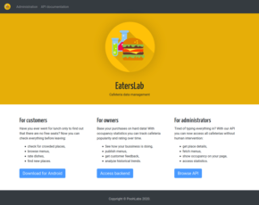</a>
    <a href="https://raw.githubusercontent.com/pooh-labs/eaterslab/master/readme-images/api-docs.png">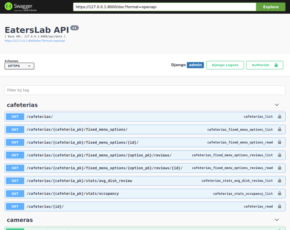</a>
    <a href="https://raw.githubusercontent.com/pooh-labs/eaterslab/master/readme-images/admin-home.png">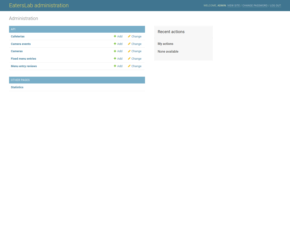</a>
    <a href="https://raw.githubusercontent.com/pooh-labs/eaterslab/master/readme-images/admin-cafeterias.png">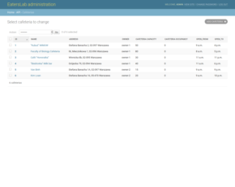</a>
    <a href="https://raw.githubusercontent.com/pooh-labs/eaterslab/master/readme-images/admin-camera-events.png">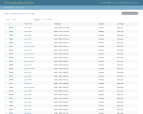</a>
    <a href="https://raw.githubusercontent.com/pooh-labs/eaterslab/master/readme-images/admin-cameras.png">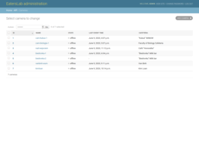</a>
    
    <a href="https://raw.githubusercontent.com/pooh-labs/eaterslab/master/readme-images/admin-reviews.png">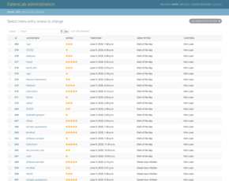</a>
    <a href="https://raw.githubusercontent.com/pooh-labs/eaterslab/master/readme-images/admin-statistics.png">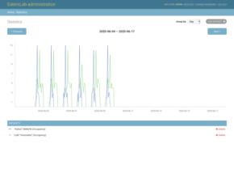</a>

### Android

    
    <a href="https://raw.githubusercontent.com/pooh-labs/eaterslab/master/readme-images/android-list.png">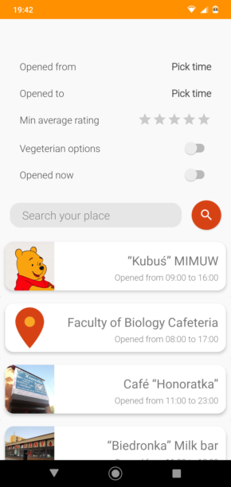</a>
    <a href="https://raw.githubusercontent.com/pooh-labs/eaterslab/master/readme-images/android-map.png">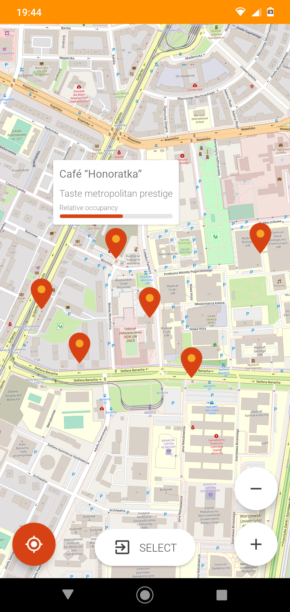</a>
    <a href="https://raw.githubusercontent.com/pooh-labs/eaterslab/master/readme-images/android-cafeteria.png">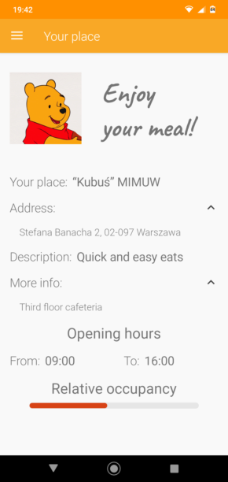</a>
    
    
    <a href="https://raw.githubusercontent.com/pooh-labs/eaterslab/master/readme-images/android-stats.png">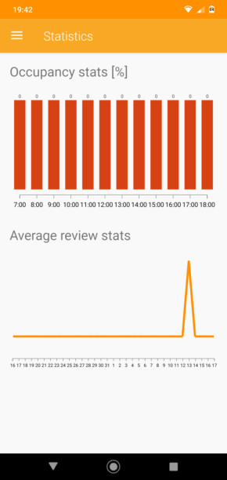</a>
    <a href="https://raw.githubusercontent.com/pooh-labs/eaterslab/master/readme-images/android-settings.png">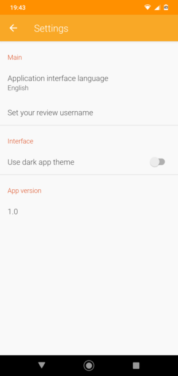</a>

## Documentation

1. [Project pitch](specs/pitch.md)
2. [Requirements specification](specs/requirements.md)
3. [Use cases list](specs/use-cases.md)
4. [System architecture specification](specs/architecture.md)
5. [Testing specification](specs/testing.md)
6. [Project plan](specs/project-plan.md)
7. [Project presentation](https://pooh-labs.github.io/eaterslab/index_en.html)

## Authors

* Krzysztof Antoniak
* Robert Michna
* Maciej Procyk
* Jakub Walendowski
