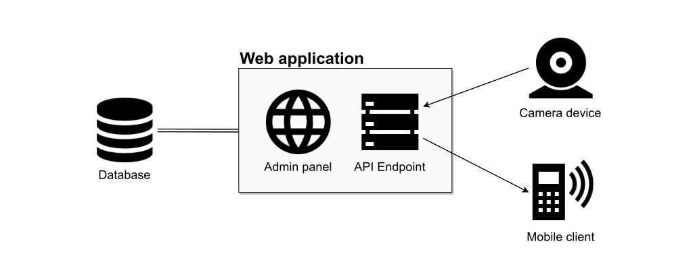
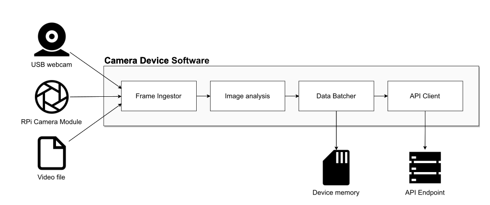

# Architecture specification

System consists of five main elements:

* Admin panel
* Database
* API endpoint
* Mobile clients
* Camera devices

## Admin panel

Admin panel is generated by Django web framework based on Django's database models. It is accessed through web browser on /admin. The admin panel allows admin user to interact with the database.

## Database

The database for this project is PostgreSQL. It supports every basic database interaction as well as concurency.
The database will either be hosted by a cloud hosting service or by a deticated computer.
SQLite database is also supported for development purposes.

## API Endpoint
Server and clients other than web application communicate via REST API. Methods definition (see /specs/api.yaml) conforms to [Open API 2.0 Specification](http://spec.openapis.org/oas/v2.0).

Server exposes API endpoint using Django Rest Framework extension. API definition file is generated from this implementation.

For API definition file generation drf_yasg is used from the server side.

Clients leverage [OpenAPI generator](https://github.com/OpenAPITools/openapi-generator) to generate the API handlers. Generated classes are not included in the repository. Please see client readme for generation instructions.

#### Generation instructions for clients apps (Android app)

Using the generated API definition file the model and API access classes can be generated. The ready to use script can be found in /android/api_generate_kotlin.sh with its usage in `README.md` file. 

If any other app is going to use designed API endpoint for clients then the given script can be reconfigured for other programming languages.

### Server and Android app communication

App loads the data from server in the background asking only for data needed to present on current app screen. The data is refreshed on every screen change in app.

When the connection with internet is lost by the device, app is suspended and waiting screen shows while waiting for active internet connection. The possible connections type supported by app are WiFi, cellular data and VPN connections.

The client app has little possibilieties to post data on public API endpoint. Client app can mainly send reviews for specified cafeterias.

## Mobile client architecture

Client app designed for Android devices is developed in Android Studio in Kotlin and Java. Build process is managed by the Gradle build system. App uses [AndroidX support libraries](https://developer.android.com/jetpack/androidx) to handle android system libraries.

For concurrenrcy purpose the standard [Kotlin coroutines](https://kotlinlang.org/docs/reference/coroutines/coroutines-guide.html) are used. The new approach allows to write cleaner code that does not look like the "full of callbacks code" but works as expected in background.

The app uses the OpenStreet Maps with the MapView designed in [osmdroid library](https://github.com/osmdroid/osmdroid) allowing the developers to customize the map look and easily manage the map data caching.

User interface needs also some data visualizations of all the data so the [data2viz library](https://github.com/data2viz/data2viz) is used to build all the needed plots and graphs from scratch in a Kotlin code and easily place them into the standard Android layouts.

For the RESTful API endpoints generation in Android app the [Kortlin code generator](https://github.com/OpenAPITools/openapi-generator/blob/master/docs/generators/kotlin.md) is used.

The client app is designed to be multilanguage app  to provide access to occupancy data also for foreign people. All the translations are managed via resource files with maapings for application text views.

## Camera devices

Camera devices are Raspberry Pi 3B+ (or newer) boards running [Raspbian Buster Lite](https://www.raspberrypi.org/downloads/raspbian/) February 2020 release. Each device is equipped with a 32GB SD card, WiFi card for internet connection and Camera Module or external USB webcam.

Device software consists of two parts:

* setup flow for registering credentials in device memory,
* main script for running analysis.

Both elements are Python 3.7 scripts with Python language bindings from other software like OpenCV.

Setup flow saves user credentials in an .env configuration file and makes a test connection with the server to confirm their validity. Test call is handled by a Python API client generated from API definition. These credentials will be later used to communicate with the server.

Main script starts automatically with the device and terminates if credentials are not set up. Its modules are as follows:

* Frame ingestor: stateless service, which collects frames from Camera device, USB webcam or input video file
* Image analysis: performs image analysis to count people coming in and out. Prediction system uses OpenCV for people detection.
* Data batcher: Batches datapoints in preset intervals, saves batches to device memory
* API client: automatically generated API client which uploads batches of events
